# Crested Porcupine Optimizer (CPO) in Python

### Overview

This project provides a **Python implementation and replication** of the **Crested Porcupine Optimizer (CPO)**, a nature-inspired metaheuristic algorithm originally proposed in the paper *"Crested Porcupine Optimizer: A New Nature-Inspired Metaheuristic"* by Mohamed Abdel-Basset et al. Our implementation aims to faithfully reproduce the algorithm's behaviors and validate its effectiveness through various tests, including **benchmark functions** and **path planning** applications.

### Features

- **CPO Algorithm Replication**: A complete Python replication of the original CPO algorithm, with configurable parameters for various optimization tasks.
- **Benchmark Testing on CEC Functions**: Validated on CEC benchmark functions (CEC2017, CEC2020, etc.), comparing the algorithm’s performance and robustness.
- **A-Enhanced Path Planning with CPO**: Applies CPO to enhance traditional A* path planning, balancing exploration and exploitation for optimized paths in complex environments.
- **Randomized Obstacle Map Generation**: Generates random obstacle maps to test path planning performance in varied scenarios.
- **Multi-Objective Optimization**: Extends CPO for multi-objective optimization, supporting applications that require Pareto-optimal front analysis.

### Repository Structure

- **`A*-CPO_path_2d.py`**: Implements 2D path planning by combining the Crested Porcupine Optimizer (CPO) with the A* algorithm for hybrid route planning.
- **`A*-CPO_path_3d.py`**: Extends the 2D path planning approach to 3D environments using the A*-CPO hybrid method.
- **`A*-CPO_path_3d_v2.py`**: An improved version of the 3D path planning script with optimizations for enhanced performance.
- **`CPO_cec2017.py`**: Contains benchmark functions from the CEC 2017 suite, supporting the testing of CPO algorithm performance.
- **`CPO_cec2022.py`**: Similar to `CPO_cec2017.py`, but using benchmark functions from the CEC 2022 suite.
- **`CPO_convergenceCurve.py`**: Visualizes convergence curves to assess the performance and stability of various CPO algorithm versions.
- **`CPO_multi_v3.py`**: Implements multi-objective optimization using CPO, with support for Pareto front visualization.
- **`CPO_multi_v4.py`**: Extends the multi-objective optimization capabilities of CPO, adding support for three objectives.
- **`CPO_population.py`**: Manages population dynamics within the CPO framework, supporting algorithm functionality.
- **`expriment_report.pdf`**: A report documenting experimental results, performance comparisons, and analyses.
- **`README.md`**: Documentation and overview of the repository.


### Key Concepts

- **Defensive Mechanisms of CPO**: Each phase of CPO mirrors a defensive behavior observed in porcupines:
  - *Sight*: Broad random exploration.
  - *Sound*: Social interaction leading to further exploration.
  - *Odor*: Convergence towards promising solutions with diversity retention.
  - *Physical Attack*: Final precision adjustments around optimal solutions.
- **Cyclic Population Reduction**: The population size decreases over time, focusing on promising solutions, replicating the porcupine’s response under threat.

### Getting Started

1. **Dependencies**: Install required libraries.
   ```bash
   pip install numpy matplotlib

2. **Run a Benchmark Test**:

   ```bash
   python CPO_cec.py
   ```

3. **Path Planning Example**:

   ```bash
   python CPO_path_planning.py
   ```

### Example Results

This repository includes sample results comparing the CPO algorithm with other popular optimizers on benchmark functions such as Sphere, Rosenbrock, and Schwefel functions, showcasing CPO's balance between exploration and convergence. For path planning, CPO demonstrates potential in generating non-overlapping, direct paths and avoiding local minima.

### Acknowledgment

This repository is a replication and extension of the CPO algorithm based on the original paper:

- **Original Paper**: "Crested Porcupine Optimizer: A New Nature-Inspired Metaheuristic" by Mohamed Abdel-Basset et al., published in *Knowledge-Based Systems*.

We would also like to express our sincere thanks to **Dr.Chengzhi Qu** from **Nanjing university of information science and technoledge**, for his valuable guidance and for providing the topic for this project.


### Additional Documentation

- **NUIST Experiment Report**: Contains detailed documentation of our experimental setup, results, and analysis of CPO on various benchmark functions and path planning tasks.

### CEC2017 Benchmark Function Visualization

The following figures showcase the performance of the Crested Porcupine Optimizer (CPO) on various CEC2017 benchmark functions (F1-F6). Each function includes a surface plot, convergence curve, and performance comparison with other optimizers.

#### F1: Sphere Function
| Function Surface and Contour | Convergence Curve | Performance Comparison |
|:-----------------------------:|:-----------------:|:----------------------:|
| 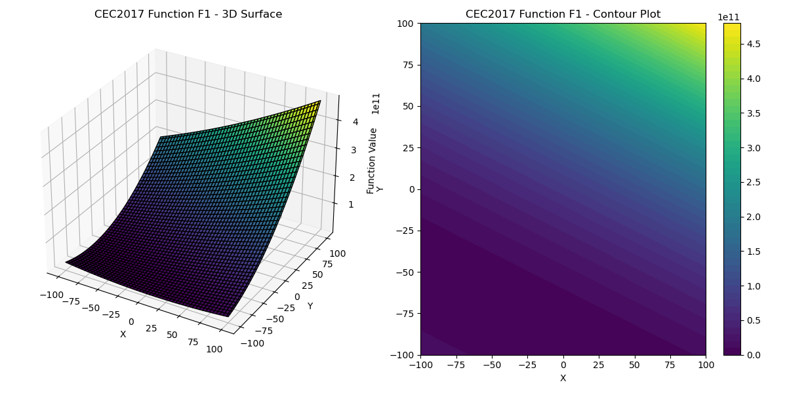 | 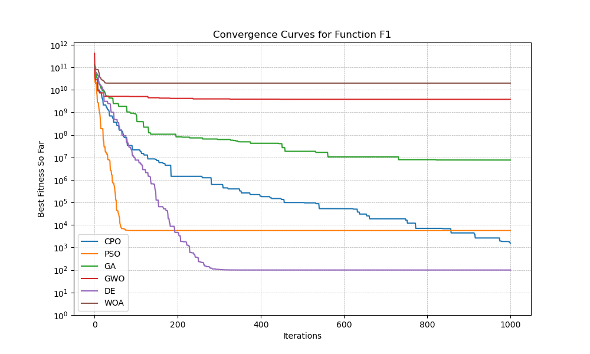 | 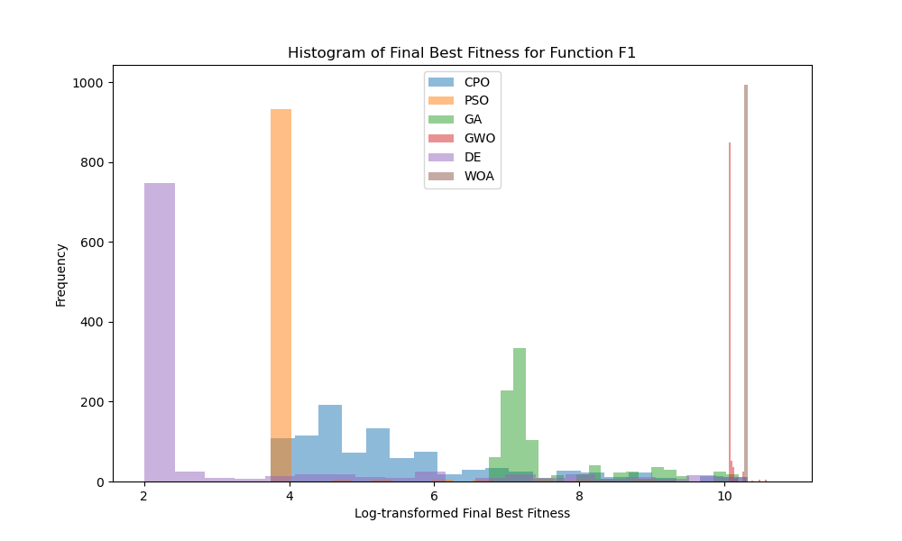 |

#### F2: Rosenbrock Function
| Function Surface and Contour | Convergence Curve | Performance Comparison |
|:-----------------------------:|:-----------------:|:----------------------:|
| 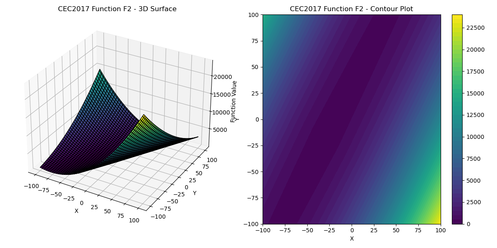 | 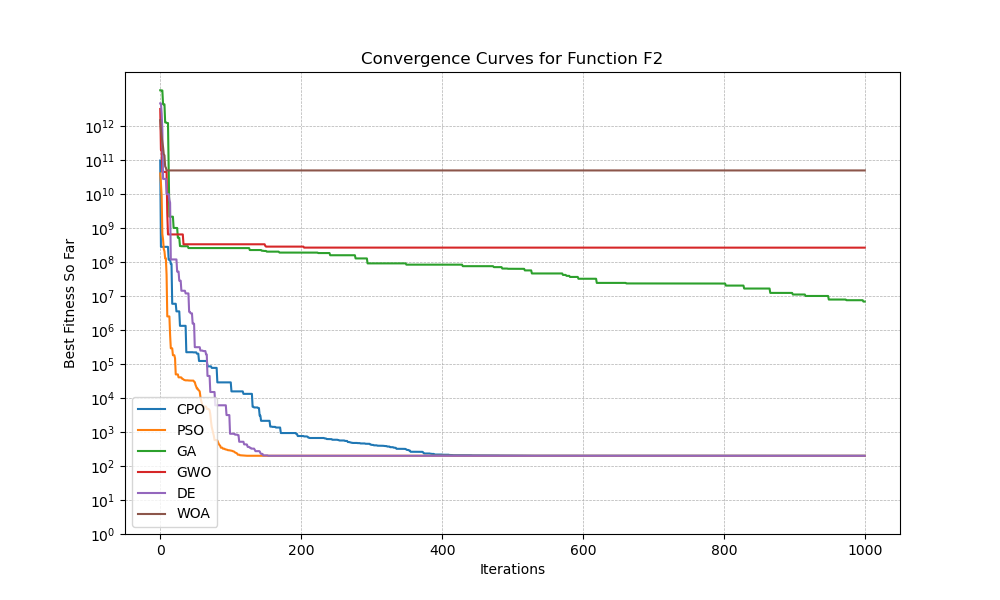 | 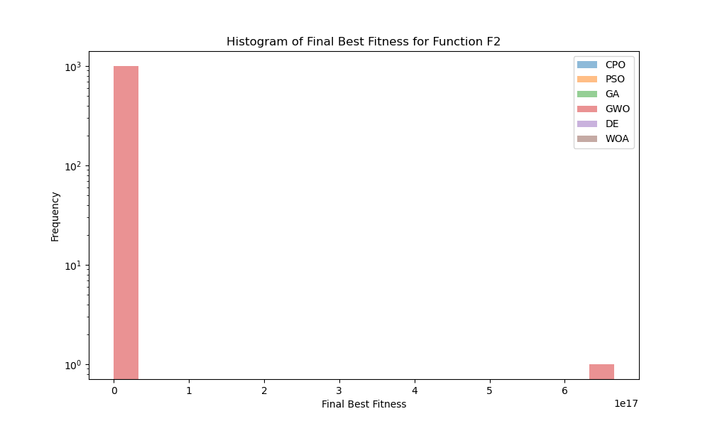 |

#### F3: Ackley Function
| Function Surface and Contour | Convergence Curve | Performance Comparison |
|:-----------------------------:|:-----------------:|:----------------------:|
| 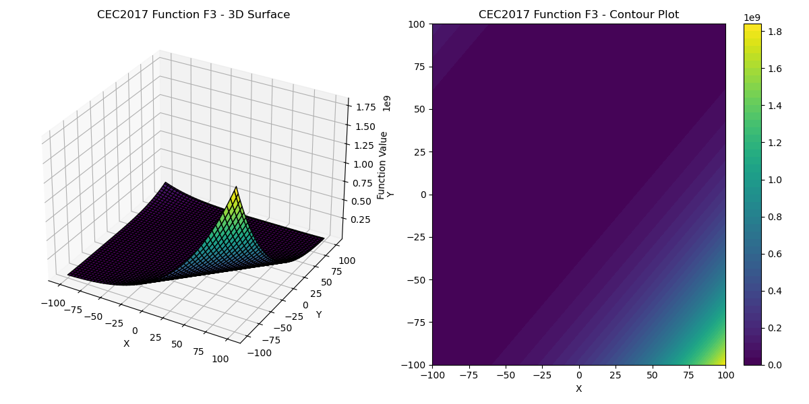 | 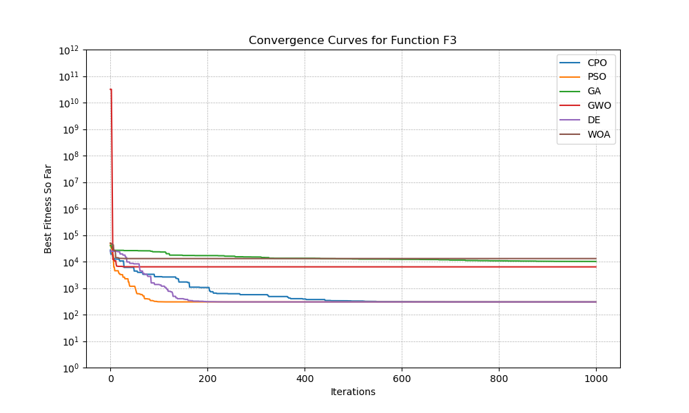 | 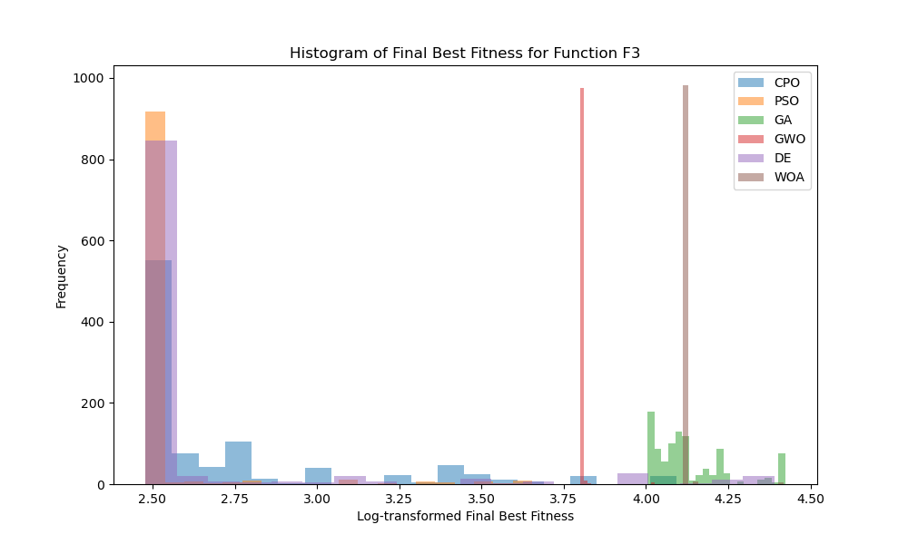 |

#### F4: Rastrigin Function
| Function Surface and Contour | Convergence Curve | Performance Comparison |
|:-----------------------------:|:-----------------:|:----------------------:|
| 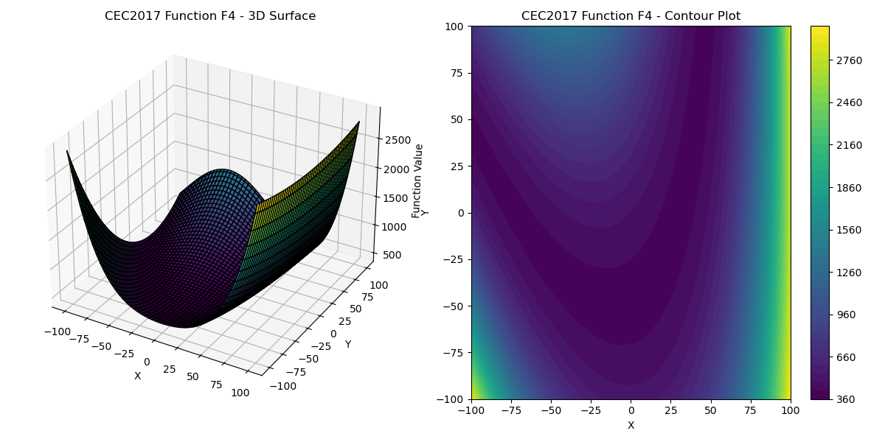 | 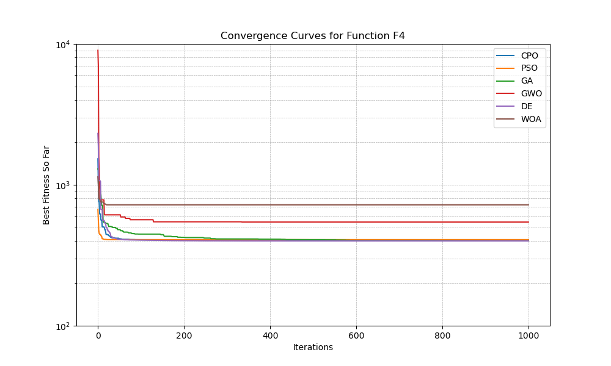 | 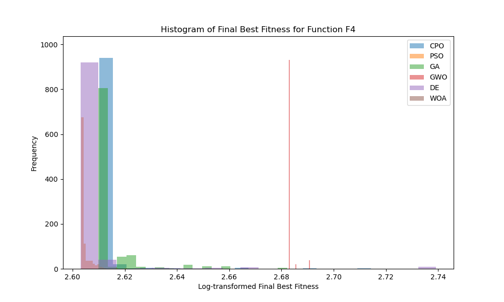 |

#### F5: Griewank Function
| Function Surface and Contour | Convergence Curve | Performance Comparison |
|:-----------------------------:|:-----------------:|:----------------------:|
| 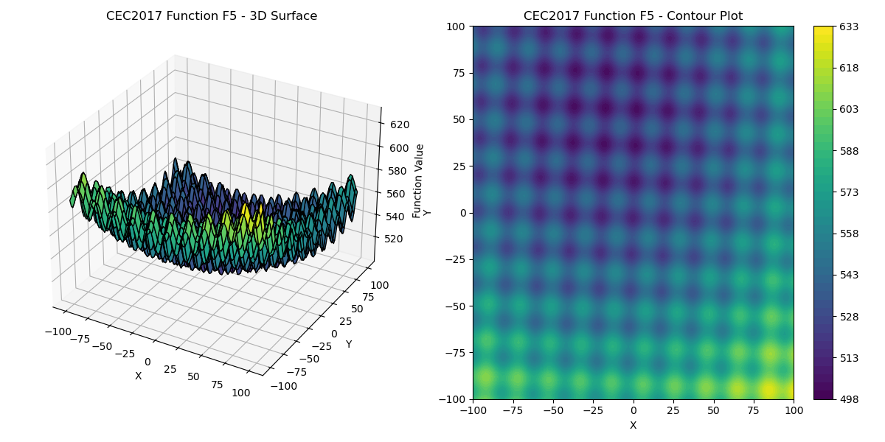 | 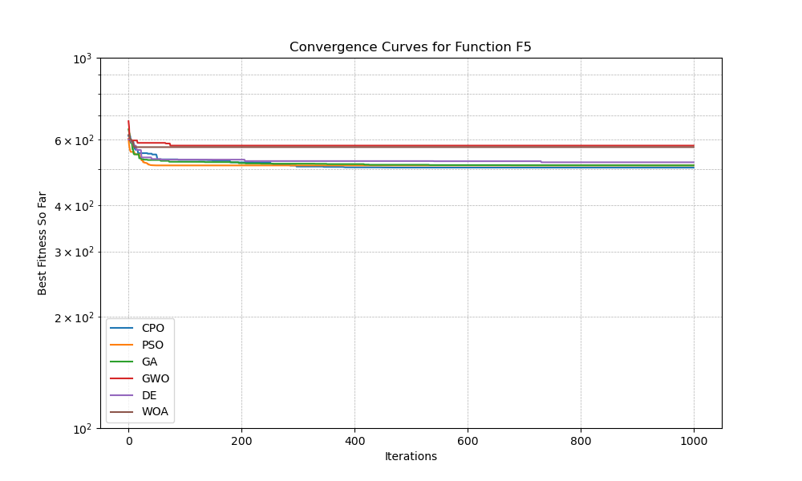 | 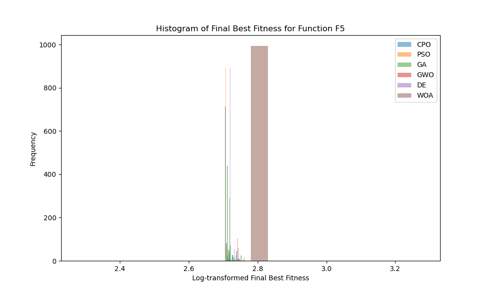 |

#### F6: Schwefel Function
| Function Surface and Contour | Convergence Curve | Performance Comparison |
|:-----------------------------:|:-----------------:|:----------------------:|
| 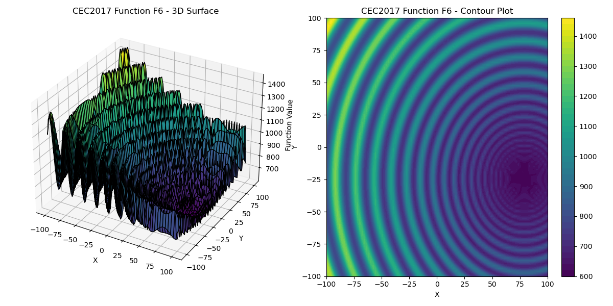 | 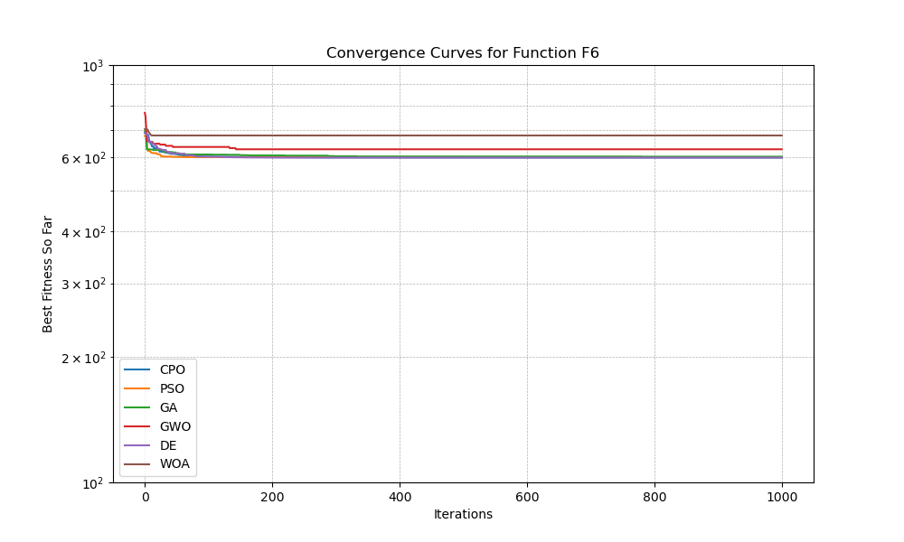 | 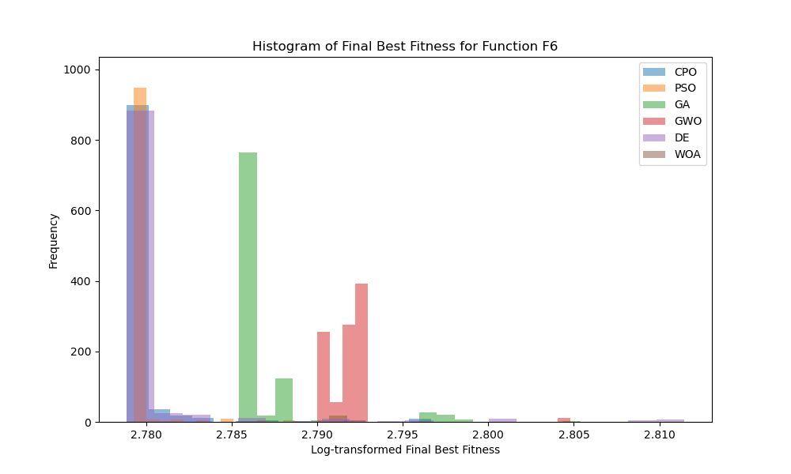 |

### Additional Analysis

These visualizations demonstrate the Crested Porcupine Optimizer’s ability to handle various optimization landscapes, showing convergence speed and accuracy across different types of functions. Each function presents unique challenges, and CPO's performance on these benchmarks highlights its robustness and adaptability.

